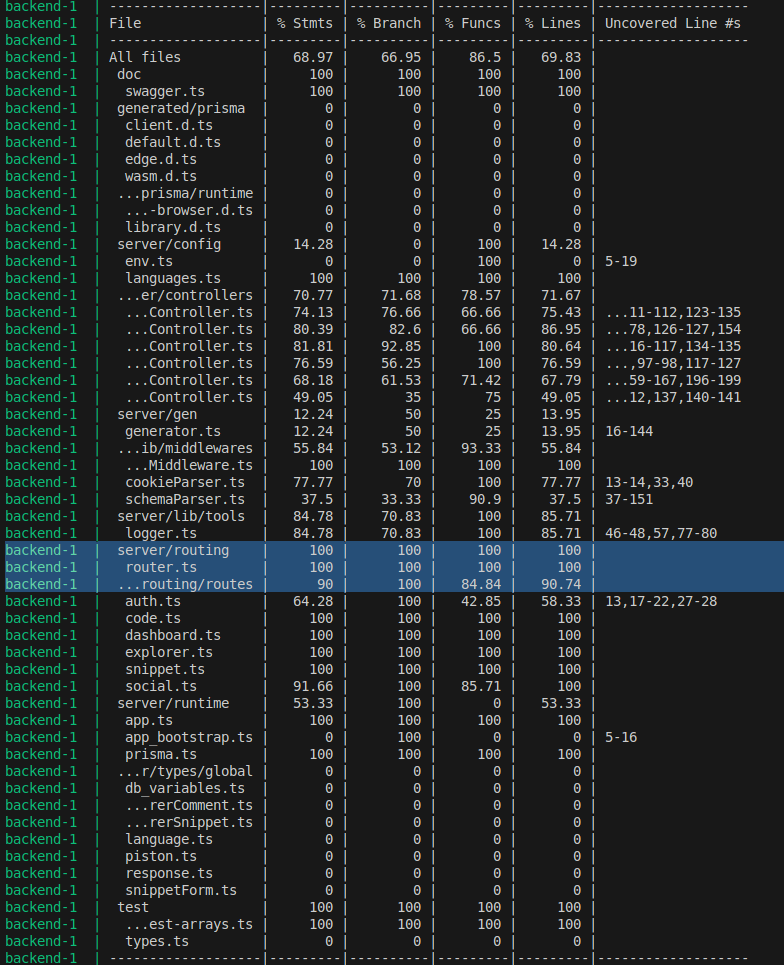

# Snipshare 📝

Snipshare est une plateforme collaborative de partage d'extraits de code. Elle permet aux développeurs de stocker, partager et découvrir des snippets de code avec une expérience utilisateur moderne et des fonctionnalités hors-ligne.

## ✨ Fonctionnalités

### 🔓 Accès public

- **Recherche avancée** : Filtrez les extraits par langage de programmation, date de création et tags
- **Navigation intuitive** : Interface claire et responsive pour parcourir les snippets

### 🔐 Fonctionnalités utilisateur connecté

- **Gestion de compte** : Créez votre compte et personnalisez votre nom d'utilisateur
- **Création de contenu** : Créez et modifiez vos propres extraits de code
- **Interactions sociales** : Likez et commentez les extraits de la communauté
- **Gestion de visibilité** : Contrôlez qui peut voir vos snippets (public/privé)
- **Partage facilité** : Générez et copiez des liens directs vers vos extraits
- **Collection personnelle** : Consultez facilement vos extraits favoris et ceux que vous avez créés

## 🚀 Démarrage rapide

### Prérequis

- Docker installé sur votre machine
- Docker Compose

### Installation

1. Clonez le repository

```bash
git clone https://github.com/nemnem202/snipshare.git
cd snipshare
```

2. Créez le fichier d'environnement approprié selon votre besoin en vous basant sur le fichier `.env.test` :

   - `.env.dev` pour l'environnement de développement
   - `.env.test` pour les tests
   - `.env.preprod` pour la préproduction
   - `.env.prod` pour la production

3. Lancez l'environnement souhaité :

```bash
# Développement
make dev

# Préproduction
make preprod

# Production
make prod
```

> ⚠️ **Note**: En cas d'échec lors de la construction des images, quittez simplement le processus et relancez la commande. Ce problème est occasionnel et une seconde tentative résout généralement le souci.

## 🌐 Accès aux services

Une fois l'environnement lancé, les services sont accessibles aux adresses suivantes :

| Service                         | URL                                   |
| ------------------------------- | ------------------------------------- |
| **Frontend**                    | `http://localhost:FRONTEND_PORT`      |
| **Adminer** (gestion BDD)       | `http://localhost:ADMINER_PORT`       |
| **Documentation API (Swagger)** | `http://localhost:BACKEND_PORT/docs/` |

> 💡 Remplacez `FRONTEND_PORT`, `ADMINER_PORT` et `BACKEND_PORT` par les valeurs définies dans votre fichier `.env`

## 🎨 Design

La maquette complète du projet est disponible sur Figma :
[Voir la maquette](https://www.figma.com/design/0sxYjbM30ct9DuYPmJHK60/Untitled?node-id=0-1&p=f&t=njuez4wSpMolCoHH-0)

## 🧪 Tests

Le projet dispose d'une suite de tests complète. Le rapport détaillé est disponible ci-dessous :



**Couverture des tests :**

- Couverture globale : **70%**
- Routes API : **90%** ✅

La couverture élevée des routes garantit la fiabilité des endpoints de l'API.

## 📁 Structure du projet

```
snipshare/
├── docs/                  # Documentation
│   └── test.png          # Rapport de tests
├── .env.dev              # Configuration développement
├── .env.test             # Configuration tests
├── .env.preprod          # Configuration préproduction
├── .env.prod             # Configuration production
├── Makefile              # Commandes de déploiement
└── README.md             # Ce fichier
```

## 🛠️ Technologies

- **Frontend** : Interface utilisateur moderne et responsive avec React
- **Backend** : API REST documentée avec Swagger
- **Base de données** : Gestion via Adminer
- **Conteneurisation** : Docker & Docker Compose
- **Support hors-ligne** : Progressive Web App (PWA)

## 👥 Contribution

Les contributions sont les bienvenues ! N'hésitez pas à ouvrir une issue ou une pull request.

---

**Développé avec ❤️ pour la communauté des développeurs**
